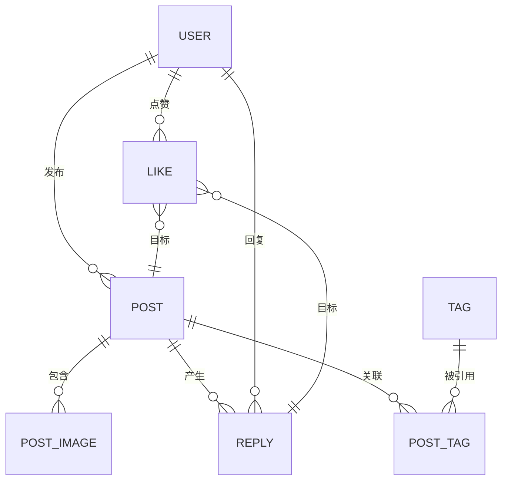

# 发帖（内容发布）API 规范文档

本文件为完整、规范、定稿的内容发布域 API 规范。包含帖子（Post）、图片（Image）、回复（Reply）、点赞（Like）、标签（Tag）五大子域。所有条款均为强制执行要求，本文件中不使用“简版”“简化”“推荐”“可选”“建议”“扩展”等措辞。

## 目录
1. [总体说明](#总体说明)
2. [状态码](#状态码)
3. [领域与数据模型](#领域与数据模型)
4. [数据库结构与 DDL](#数据库结构与-ddl)
5. [请求与响应数据结构](#请求与响应数据结构)
6. [接口定义](#接口定义)
7. [标签规则](#标签规则)
8. [向量与相似检索](#向量与相似检索)
9. [核心业务流程](#核心业务流程)
10. [业务规则与验证约束](#业务规则与验证约束)
11. [错误返回格式与示例](#错误返回格式与示例)
12. [实施步骤](#实施步骤)
13. [单元与集成测试计划](#单元与集成测试计划)
14. [演进路线](#演进路线)
15. [版本历史](#版本历史)

---

## 总体说明
协议：HTTPS JSON REST。编码：UTF-8。时间格式：ISO-8601（UTC 或带时区偏移）。
认证：JWT（Authorization: Bearer <token>）。未登录访问需遵循接口表中“认证”列要求。
统一响应结构：
```json
{"code":0,"message":"OK","data":{},"traceId":"uuid"}
```
字段说明：code(业务码)；message(人类可读)；data(业务数据，可为 null)；traceId(链路追踪，全局过滤器生成)。

## 状态码
| code | HTTP | message | 说明 |
|------|------|---------|------|
| 0 | 200 | OK | 成功 |
| 1000 | 400 | Bad Request | 参数缺失/非法 |
| 1001 | 400 | Validation Failed | Bean 校验不通过 |
| 1002 | 400 | Illegal State | 资源当前状态禁止操作 |
| 1003 | 400 | Unsupported Media | 不支持的媒体类型 |
| 1004 | 404 | Resource Not Found | 通用资源不存在 |
| 1005 | 409 | Conflict | 版本或并发冲突 |
| 1006 | 429 | Too Many Requests | 频率限制 |
| 2000 | 401 | Unauthorized | 未认证 |
| 2001 | 401 | Token Invalid | Token 非法 |
| 2002 | 401 | Token Expired | Token 过期 |
| 2003 | 403 | Forbidden | 权限不足 |
| 2004 | 403 | User Banned | 用户被禁用 |
| 3000 | 404 | User Not Found | 用户不存在 |
| 3001 | 409 | User Exists | 用户已存在 |
| 3002 | 400 | Bad Credentials | 凭证错误 |
| 3003 | 500 | User Update Failed | 用户更新失败 |
| 4000 | 404 | Post Not Found | 帖子不存在 |
| 4001 | 400 | Post Create Failed | 创建帖子失败 |
| 4002 | 400 | Post Update Failed | 更新帖子失败 |
| 4003 | 403 | Post Forbidden | 帖子被禁用/隐藏 |
| 4004 | 500 | Post Delete Failed | 删除帖子失败 |
| 4005 | 404 | Reply Not Found | 回复不存在 |
| 4006 | 400 | Reply Create Failed | 创建回复失败 |
| 4007 | 500 | Reply Delete Failed | 删除回复失败 |
| 4008 | 400 | Tag Invalid | 标签数量或格式非法 |
| 4009 | 404 | Tag Not Found | 标签不存在 |
| 4010 | 400 | Image Invalid | 图片参数非法 |
| 4011 | 500 | Image Upload Failed | 图片上传失败 |
| 4012 | 500 | Image Delete Failed | 图片删除失败 |
| 5000 | 400 | Already Liked | 已处于点赞状态（幂等） |
| 5001 | 400 | Not Liked | 未点赞不可取消 |
| 5002 | 500 | Like Operation Failed | 点赞操作失败 |
| 8000 | 500 | Vector Index Error | 向量检索失败 |
| 8001 | 503 | External Service Down | 外部服务不可用 |
| 9000 | 500 | Internal Error | 内部错误兜底 |

## 领域与数据模型
关系：Post 1-N Image；Post 1-N Reply；Reply 自引用 parentReplyId；User 与 Post/Reply/Like 为 1-N；Post 多对多 Tag；Like 目标类型 Post|Reply；Post.embedding 用于相似检索；Tag 不存向量。

ER 图：


## 数据库结构与 DDL
使用 PostgreSQL + pgvector。所有时间列使用 timestamptz。布尔型使用 boolean。软删除通过 state 字段表达；未采用逻辑删除的表省略删除状态。

```sql
CREATE EXTENSION IF NOT EXISTS vector;

-- 用户（项目已经存在，根据实际情况进行更改）
CREATE TABLE IF NOT EXISTS app_user (
  id BIGSERIAL PRIMARY KEY,
  username VARCHAR(50) NOT NULL UNIQUE,
  password_hash TEXT NOT NULL,
  state SMALLINT NOT NULL DEFAULT 0, -- 0 正常 1 禁用
  created_at TIMESTAMPTZ NOT NULL DEFAULT now()
);

CREATE TABLE IF NOT EXISTS post (
  id BIGSERIAL PRIMARY KEY,
  user_id BIGINT NOT NULL REFERENCES app_user(id) ON DELETE CASCADE,
  title VARCHAR(120) NOT NULL,
  content TEXT NOT NULL,
  like_count INT NOT NULL DEFAULT 0,
  reply_count INT NOT NULL DEFAULT 0,
  visit_count INT NOT NULL DEFAULT 0,
  state SMALLINT NOT NULL DEFAULT 0, -- 0 正常 1 隐藏 2 删除
  embedding VECTOR(768),
  created_at TIMESTAMPTZ NOT NULL DEFAULT now(),
  updated_at TIMESTAMPTZ NOT NULL DEFAULT now()
);
CREATE INDEX IF NOT EXISTS idx_post_user ON post(user_id);
CREATE INDEX IF NOT EXISTS idx_post_created ON post(created_at DESC);

CREATE TABLE IF NOT EXISTS post_image (
  id BIGSERIAL PRIMARY KEY,
  post_id BIGINT NOT NULL REFERENCES post(id) ON DELETE CASCADE,
  url TEXT NOT NULL,
  display_order INT NOT NULL DEFAULT 0,
  created_at TIMESTAMPTZ NOT NULL DEFAULT now()
);
CREATE INDEX IF NOT EXISTS idx_post_image_post ON post_image(post_id, display_order);

CREATE TABLE IF NOT EXISTS reply (
  id BIGSERIAL PRIMARY KEY,
  post_id BIGINT NOT NULL REFERENCES post(id) ON DELETE CASCADE,
  parent_reply_id BIGINT REFERENCES reply(id) ON DELETE CASCADE,
  user_id BIGINT NOT NULL REFERENCES app_user(id) ON DELETE CASCADE,
  content TEXT NOT NULL,
  like_count INT NOT NULL DEFAULT 0,
  created_at TIMESTAMPTZ NOT NULL DEFAULT now()
);
CREATE INDEX IF NOT EXISTS idx_reply_post ON reply(post_id, created_at DESC);
CREATE INDEX IF NOT EXISTS idx_reply_parent ON reply(parent_reply_id);

CREATE TABLE IF NOT EXISTS tag (
  id BIGSERIAL PRIMARY KEY,
  name VARCHAR(32) NOT NULL,
  normalized_name VARCHAR(32) NOT NULL,
  hot_score INT NOT NULL DEFAULT 0,
  created_at TIMESTAMPTZ NOT NULL DEFAULT now(),
  UNIQUE(normalized_name)
);

CREATE TABLE IF NOT EXISTS post_tag (
  post_id BIGINT NOT NULL REFERENCES post(id) ON DELETE CASCADE,
  tag_id BIGINT NOT NULL REFERENCES tag(id) ON DELETE CASCADE,
  bound_at TIMESTAMPTZ NOT NULL DEFAULT now(),
  PRIMARY KEY(post_id, tag_id)
);
CREATE INDEX IF NOT EXISTS idx_post_tag_tag ON post_tag(tag_id);

CREATE TABLE IF NOT EXISTS user_like (
  id BIGSERIAL PRIMARY KEY,
  user_id BIGINT NOT NULL REFERENCES app_user(id) ON DELETE CASCADE,
  target_type SMALLINT NOT NULL, -- 0 post 1 reply
  target_id BIGINT NOT NULL,
  created_at TIMESTAMPTZ NOT NULL DEFAULT now(),
  UNIQUE(user_id, target_type, target_id)
);
CREATE INDEX IF NOT EXISTS idx_like_target ON user_like(target_type, target_id);

-- 可选（如需更高效相似检索）创建向量索引：数据规模稳定后执行
-- CREATE INDEX idx_post_embedding ON post USING ivfflat (embedding vector_cosine_ops) WITH (lists=100);
```

## 请求与响应数据结构
所有 DTO 字段未特别说明均必填。

### 通用分页
```json
{"records":[],"total":0}
```

### 请求 DTO
PostCreateRequest:
```json
{"title":"标题<=120","content":"正文","tags":["领域A","领域B"]}
```
PostUpdateRequest:
```json
{"title":"新标题","content":"新内容"}
```
ReplyCreateRequest:
```json
{"postId":1,"parentReplyId":100,"content":"回复文本"}
```
LikeRequest 不需要体（使用路径）。

### 响应 DTO
PostSummaryDTO:
```json
{"id":1,"userId":10,"title":"标题","visitCount":12,"replyCount":2,"likeCount":5,"createTime":"2025-08-19T12:00:00","updateTime":"2025-08-19T12:30:00","tags":["领域A"],"user":{"id":10,"username":"u"}}
```
PostDetailDTO:
```json
{"id":1,"userId":10,"title":"标题","content":"正文","visitCount":321,"replyCount":8,"likeCount":50,"createTime":"2025-08-19T12:00:00","updateTime":"2025-08-19T12:30:00","own":true,"tags":["领域A"],"user":{"id":10,"username":"u"}}
```
ReplySummaryDTO:
```json
{"id":100,"postId":1,"parentReplyId":55,"userId":22,"content":"回复内容","likeCount":3,"createTime":"2025-08-19T13:00:00","childrenCount":2,"user":{"id":22,"username":"r"}}
```
ReplyPageDTO:
```json
{"records":[{"id":100}],"total":40}
```
ImageDTO:
```json
{"imageId":999,"url":"/img/xxx.png","fileName":"xxx.png","fileType":"image/png","fileSize":12345,"displayOrder":0,"fullUrl":"https://cdn.xxx/xxx.png"}
```
TagDTO:
```json
{"id":12,"name":"领域A","hotScore":321}
```
LikeStateDTO:
```json
{"liked":true}
```

## 接口定义
### 1. 帖子
| 功能 | 方法 | URL | 认证 | 请求体 | Query 参数 | 返回 |
|------|------|-----|------|--------|------------|------|
| 创建帖子 | POST | /posts | 是 | PostCreateRequest | - | PostDetailDTO |
| 更新帖子 | PUT | /posts/{postId} | 是 | PostUpdateRequest | - | PostDetailDTO |
| 删除帖子 | DELETE | /posts/{postId} | 是 | - | - | 空 |
| 分页列表 | GET | /posts | 否 | - | page,size,tag | {records:PostSummaryDTO[],total} |
| 帖子详情 | GET | /posts/{postId} | 否 | - | - | PostDetailDTO |
| 用户帖子 | GET | /users/{userId}/posts | 否 | - | page,size | {records:PostSummaryDTO[],total} |
| 相似帖子 | GET | /posts/{postId}/similar | 否 | - | limit(默认10) | {records:PostSummaryDTO[],total} |

### 2. 标签
| 功能 | 方法 | URL | 认证 | 请求体 | Query | 返回 |
|------|------|-----|------|--------|-------|------|
| 创建或获取 | POST | /tags | 是 | {"name":"领域A"} | - | TagDTO |
| 模糊查询 | GET | /tags/search | 否 | - | keyword | TagDTO[] |
| 热门标签 | GET | /tags/hot | 否 | - | limit | TagDTO[] |
| 覆盖帖子标签 | PUT | /posts/{postId}/tags | 是 | ["领域A","领域B"] | - | TagDTO[] |
| 获取帖子标签 | GET | /posts/{postId}/tags | 否 | - | - | TagDTO[] |

### 3. 图片
| 功能 | 方法 | URL | 认证 | 请求 | 返回 |
|------|------|-----|------|------|------|
| 上传图片 | POST | /posts/{postId}/images | 是 | multipart(file,displayOrder) | ImageDTO |
| 图片列表 | GET | /posts/{postId}/images | 否 | - | ImageDTO[] |
| 删除图片 | DELETE | /images/{imageId} | 是 | - | 空 |

### 4. 回复
| 功能 | 方法 | URL | 认证 | 请求体 | Query | 返回 |
|------|------|-----|------|--------|-------|------|
| 创建回复 | POST | /replies | 是 | ReplyCreateRequest | - | 空 |
| 顶层分页 | GET | /replies | 否 | - | postId,page,size | ReplyPageDTO |
| 子级分页 | GET | /replies/{replyId}/children | 否 | - | page,size | ReplySummaryDTO[] |
| 删除回复 | DELETE | /replies/{replyId} | 是 | - | - | 空 |

### 5. 点赞
| 功能 | 方法 | URL | 认证 | 返回 |
|------|------|-----|------|------|
| 点赞帖子 | PUT | /posts/{postId}/like | 是 | LikeStateDTO |
| 取消帖子点赞 | DELETE | /posts/{postId}/like | 是 | LikeStateDTO |
| 查询帖子点赞状态 | GET | /posts/{postId}/like | 是 | LikeStateDTO |
| 点赞回复 | PUT | /replies/{replyId}/like | 是 | LikeStateDTO |
| 取消回复点赞 | DELETE | /replies/{replyId}/like | 是 | LikeStateDTO |
| 查询回复点赞状态 | GET | /replies/{replyId}/like | 是 | LikeStateDTO |

## 标签规则
1. 标签名输入进行 trim，转小写得到 normalized_name；展示保留原大小写形式（name）。
2. 单帖标签数上限 8；超出返回 4008。
3. 覆盖更新需一次性完整提交新集合，后端计算差集：新增插入、缺失删除、已存在忽略。
4. 标签不存在时自动创建（原子操作，利用 normalized_name 唯一约束防并发重复）。
5. 删除帖子自动级联删除 post_tag 记录；未引用标签不自动物理删除。
6. hot_score 更新公式：like_count*3 + reply_count*2 + visit_count*0.1（按批处理或定时任务刷新）。

## 向量与相似检索
1. embedding 内容：title + '\n' + content。
2. 创建帖子后异步生成向量并更新 embedding 列；失败记录重试表或重试队列。
3. 相似查询：
```
SELECT id,title,like_count,reply_count,visit_count
FROM post
WHERE id <> :id AND embedding IS NOT NULL
ORDER BY embedding <=> (SELECT embedding FROM post WHERE id=:id)
LIMIT :limit;
```
4. 向量索引 ivfflat 需在向量规模与稳定后创建；创建前使用顺序扫描或 HNSW 外部服务。
5. 更新帖子内容时需重新生成 embedding；可延迟执行。

## 核心业务流程
### 发帖流程
1. 接收 PostCreateRequest 校验（标题/正文/标签上限）。
2. 事务插入 post；初始 like_count/reply_count/visit_count=0，embedding NULL。
3. 标签覆盖绑定（幂等）。
4. 异步任务生成向量并更新 embedding。
5. 返回 PostDetailDTO。

### 点赞流程（帖子）
1. 校验登录与帖子存在。
2. 插入 user_like（target_type=0）。冲突则忽略并保持幂等。
3. 成功后原子增加 post.like_count（或使用乐观更新）。

### 回复创建流程
1. 校验 post 存在与状态。
2. 若 parentReplyId 非空，校验父回复存在且同一 post。
3. 插入 reply，增量更新 post.reply_count。

### 标签覆盖流程
1. 读取现有标签集合。
2. 归一化并去重输入标签。
3. 校验数量 ≤ 8。
4. 查询/插入缺失标签；构造新增集合与删除集合；批处理执行。

### 访问计数
GET /posts/{id} 成功返回后异步 +1（或乐观 `UPDATE post SET visit_count=visit_count+1 WHERE id=?`）。

### 相似检索
1. 获取源帖子 embedding；若空返回空集合。
2. 执行相似 SQL；过滤隐藏/删除状态。

## 业务规则与验证约束
| 场景 | 约束 |
|------|------|
| 标题 | 1~120 字符 |
| 正文 | 非空 |
| 标签名 | 非空，<=32，去除首尾空白 |
| 标签数量 | ≤8 |
| 图片 MIME | image/png,image/jpeg,image/webp 等白名单 |
| 图片顺序 | display_order 非负整数 |
| 回复内容 | 非空，长度<=2000（示例） |
| 点赞幂等 | 已点赞再次点赞返回 liked=true 不报错 |
| 取消点赞 | 未点赞取消返回 liked=false |
| 删除帖子 | 仅作者或具备管理权限用户 |
| 删除回复 | 作者或管理权限用户 |
| 相似检索 | embedding 不存在返回空集合 code=0 |

## 错误返回格式与示例
参数错误：
```json
{"code":1000,"message":"Bad Request","data":null,"traceId":"t1"}
```
标签超限：
```json
{"code":4008,"message":"Tag Invalid","data":null,"traceId":"t2"}
```
帖子不存在：
```json
{"code":4000,"message":"Post Not Found","data":null,"traceId":"t3"}
```

## 实施步骤
1. 建库并执行全部 DDL（含 pgvector 扩展）。
2. 定义枚举或常量类保存业务状态码。
3. 建立统一异常处理与校验失败拦截。
4. 实现仓储：Post / Reply / Tag / PostTag / Image / UserLike 基础 CRUD 与查询。
5. 实现服务：发帖、标签覆盖、回复、点赞、相似检索、访问计数。
6. 集成 Embedding 客户端（生成向量异步线程池）。
7. 编写控制器映射接口定义，输出统一响应结构。
8. 编写测试（见下）。
9. 部署时根据数据量创建或延后创建向量索引。

## 单元与集成测试计划
| 模块 | 测试用例 | 断言 |
|------|----------|------|
| PostService | 创建帖子 | 返回 id 与初始计数=0 |
| PostService | 标签超限 | code=4008 |
| PostService | 覆盖标签（新增+删除） | 最终集合与预期一致 |
| LikeService | 点赞幂等 | 连续两次 liked=true 且计数增 1 |
| LikeService | 取消未点赞 | liked=false 计数不为负 |
| ReplyService | 楼中楼父校验 | 不存在父返回 4005 |
| ReplyService | 创建回复计数 | reply_count 增 1 |
| SimilarService | 无 embedding | 返回空集合 |
| SimilarService | 有 embedding | 返回不含自身且按相似度排序 |
| TagRepository | 并发创建同名标签 | 仅一条记录 |
| ImageUpload | 非法 MIME | 1003 |
| Controller/Auth | 未登录访问需认证接口 | 2000 |

覆盖率要求：Service 语句≥90% 分支≥80%；Controller 语句≥85%。

## 演进路线
| 阶段 | 内容 |
|------|------|
| Phase 1 | 上线核心：帖子/标签/回复/点赞/图片 + 向量生成异步 |
| Phase 2 | 热门标签统计任务 + 相似检索优化 + 标签热度榜 |
| Phase 3 | 富文本/Markdown 支持 + 草稿箱 + 举报与审核 |
| Phase 4 | 个性化推荐排序、内容风控、A/B 评估 |

## 版本历史
| 版本 | 日期 | 说明 |
|------|------|------|
| 1.4.0 | 2025-08-23 | 统一规范：去除所有简化/建议措辞，清理遗留旧接口与命名，补全 DDL 与测试计划 |

---
